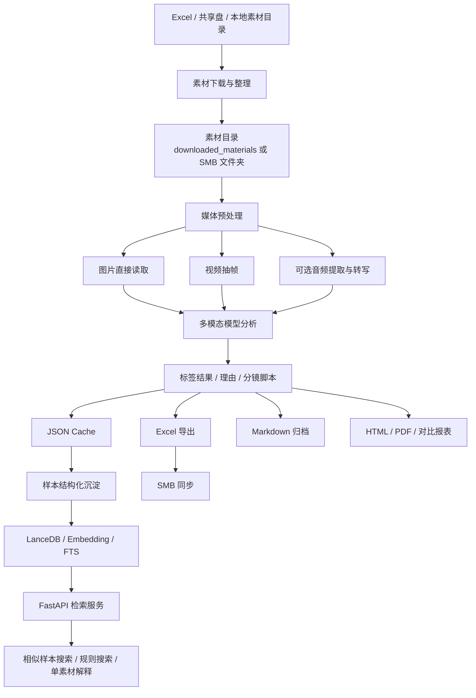
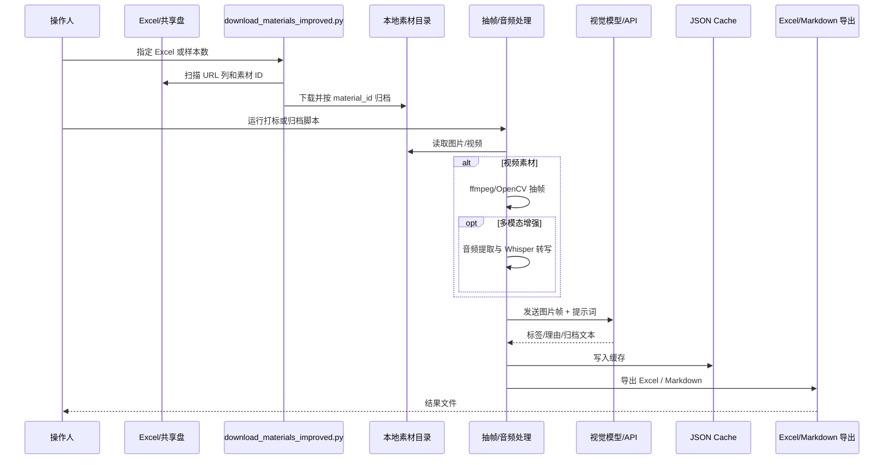
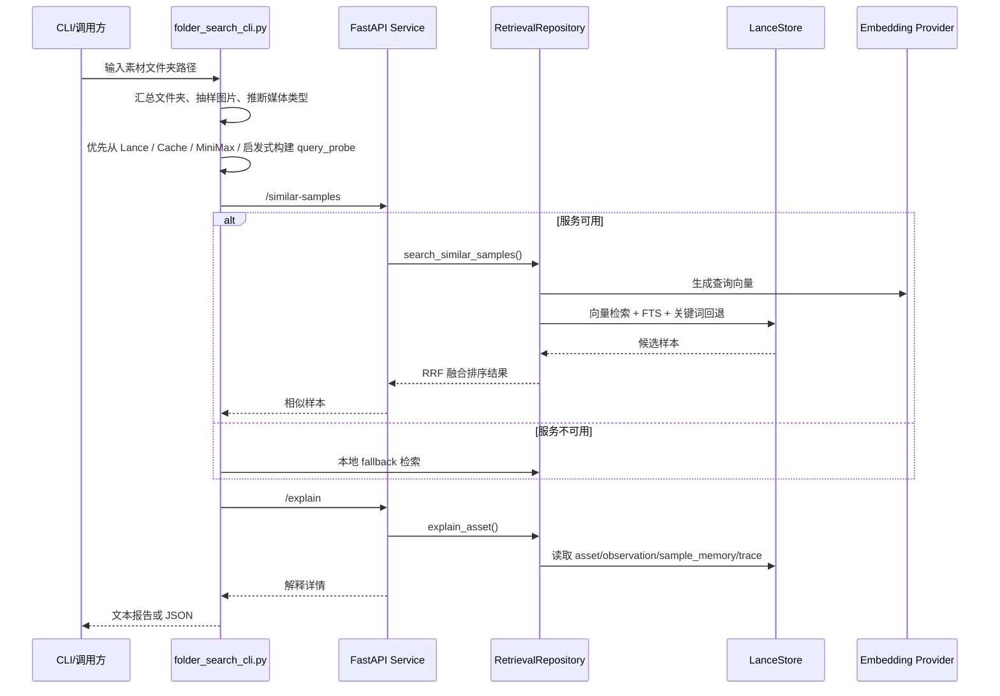

# ai-content-realize 项目分析与生产使用说明

## 1. 项目定位

`ai-content-realize` 不是单一的 Web 应用或标准 Python 包，而是一个围绕“电商内容素材打标、归档、检索、导出、同步”逐步演化出来的工程化工具集。  
它服务的核心业务对象，是按素材 ID 组织的一组图片或视频素材文件夹，目标是利用多模态模型把这些素材自动归类、生成判定依据，并进一步沉淀为可检索、可复核、可导出的运营资产。

从代码现状看，项目主要包含两条主干能力：

1. **素材分析与打标流水线**
   - 下载素材
   - 识别图片 / 视频
   - 视频抽帧 / 可选音频转写
   - 调用视觉模型做标签判定或内容归档
   - 缓存结果
   - 导出 Excel / Markdown / PDF / HTML
   - 可选同步到 SMB

2. **样本知识库与检索服务**
   - 将历史打标样本结构化
   - 生成 observation / rule / sample memory / decision trace
   - 通过 LanceDB + embedding + FTS 做混合检索
   - 提供相似样本搜索、规则搜索、单素材解释接口

这两条线并不完全收敛在同一个统一框架内，因此 README 必须忠实反映现状：**这是一个“正在生产实践中使用，但尚未完全产品化封装”的多脚本仓库。**

---

## 2. 需求主旨

### 2.1 业务目标

项目试图解决的是一个典型的内容运营难题：

- 大量素材来自 Excel、共享盘、运营投放链路，来源杂、数量大、格式不统一。
- 素材既有图片，也有视频；视频还需要抽帧后才能进入统一分析链路。
- 标签判定标准并不是简单图像分类，而是带有明显业务语义，例如：
  - 性能测评
  - 明星穿搭
  - 穿搭精选（核心 / 次要）
  - 单品展示（上脚）
  - 创意静物
  - 静物展示
- 运营不只要“标签结果”，还要“为什么这么判”，并需要落到 Excel、报告、复核流程中。
- 当模型能力、API 配额、服务稳定性不稳定时，需要缓存、断点续跑、重试、切换模型、同步共享盘等工程补偿手段。

### 2.2 这个项目要解决什么问题

可归纳为 5 个核心问题：

1. **素材接入问题**  
   如何从 Excel 或共享盘把多来源素材整理为统一目录结构。

2. **多模态分析问题**  
   如何对图片、视频帧、可选音频文本进行统一标签判断或内容归档。

3. **结果可复用问题**  
   如何把一次性模型输出变成缓存、Excel、Markdown、知识库记录，而不是只停留在命令行日志。

4. **生产稳定性问题**  
   如何在 API 限流、服务过载、配额耗尽、长任务中断时继续运行。

5. **检索与解释问题**  
   如何让后续新素材能参考历史“相似样本”和“规则卡片”，形成半结构化的决策支持体系。

---

## 3. 代码现状总评估

### 3.1 总体判断

这是一个**业务驱动很强、工程迭代很快、但结构尚未完全收敛**的项目。

它的优点不是“形式整洁”，而是：

- 已经覆盖素材下载、打标、归档、缓存、导出、同步、检索多个闭环环节。
- 对生产问题有很强的现实感知，例如：
  - 限流
  - 529 / 5xx
  - 配额切换
  - SMB 同步
  - 断点续跑
  - 视频抽帧
- 有明显的“先跑通业务，再逐步工程化”的痕迹。

它的主要问题也很明确：

- 缺少统一入口和统一依赖描述。
- 存在多条历史分支脚本，职责部分重叠。
- 一些脚本引用了仓库外模块，单仓库无法直接冷启动。
- 配置方式不统一，环境变量命名存在分叉。
- 测试脚本较多，但缺少规范化测试套件与 CI。

### 3.2 现状成熟度分层

#### A. 可直接用于本地或半生产运行的部分

- [download_materials_improved.py](/Users/kaori/Documents/ai-content-realize/download_materials_improved.py:1)
- [extract_frames.py](/Users/kaori/Documents/ai-content-realize/extract_frames.py:1)
- [gemini_label_materials.py](/Users/kaori/Documents/ai-content-realize/gemini_label_materials.py:1)
- [gemma_dewu_archiver.py](/Users/kaori/Documents/ai-content-realize/gemma_dewu_archiver.py:1)
- [cache_sync_to_smb.py](/Users/kaori/Documents/ai-content-realize/cache_sync_to_smb.py:1)
- 一批 Excel / cache 导出与修复脚本

#### B. 需要外部依赖仓库或额外模块才能工作

- [multimodal_label_service/app.py](/Users/kaori/Documents/ai-content-realize/multimodal_label_service/app.py:1)
- [multimodal_label_service/retriever.py](/Users/kaori/Documents/ai-content-realize/multimodal_label_service/retriever.py:1)
- [multimodal_label_service/folder_search_cli.py](/Users/kaori/Documents/ai-content-realize/multimodal_label_service/folder_search_cli.py:1)

原因：

- 依赖本仓库中不存在的模块：
  - `multimodal_label_store`
  - `multimodal_label_eval`
  - `multimodal_label_knowledge`
  - `minimax_mcp_client`

#### C. 历史试验 / 阶段性方案 / 诊断材料

- 多份 `PRODUCTION_*`、`*_ANALYSIS.md`、`FINAL_SOLUTION.md`
- 多个 `test_*.py`
- 多种 `minimax_*`、`minicpm_*` 变体脚本

这些文件有参考价值，但不能简单等同于当前唯一事实来源。

### 3.3 架构判断

如果从工程抽象上看，本项目已经隐含出 4 层架构：

1. **接入层**：Excel / SMB / 本地素材目录
2. **分析层**：视觉模型、视频抽帧、音频转写、标签判定
3. **沉淀层**：JSON cache、Excel、Markdown 报告、Lance 样本库
4. **服务层**：相似样本检索、规则检索、单素材解释

这 4 层是合理的。当前问题不在于设计方向错，而在于**实现分散在多个脚本，尚未完全统一成一个稳定产品壳。**

---

## 4. 项目目录与模块分解

## 4.1 高价值模块

### 4.1.1 素材下载与准备

- [download_materials_improved.py](/Users/kaori/Documents/ai-content-realize/download_materials_improved.py:1)
  - 从 Excel 中自动发现 URL 列
  - 抽取素材 ID
  - 下载图片 / 视频到 `downloaded_materials/<material_id>/`
  - 支持并发、重试、断点续传

- [extract_frames.py](/Users/kaori/Documents/ai-content-realize/extract_frames.py:1)
  - 使用 OpenCV 对视频进行定间隔抽帧
  - 为视频统一进入图片分析链路提供基础能力

### 4.1.2 打标与归档主流程

- [gemini_label_materials.py](/Users/kaori/Documents/ai-content-realize/gemini_label_materials.py:1)
  - 偏“标签分类”导向
  - 使用 Gemini 兼容接口
  - 支持图片直传、视频抽帧后分析、JSON cache、Excel 导出

- [gemma_dewu_archiver.py](/Users/kaori/Documents/ai-content-realize/gemma_dewu_archiver.py:1)
  - 偏“内容归档 / 分镜脚本生成”导向
  - 支持多 provider：
    - `custom_minmax`
    - `minmax`
    - `minmax_mcp`
    - `kimi`
    - `kimi_coding`
    - `paddle`
    - `minicpm`
  - 支持图片和视频
  - 视频通过 `ffmpeg` 按 1fps 抽帧
  - 支持重试、退避、进度统计、断点跳过
  - 输出 Markdown 报告

- [minimax_mcp_multimodal_label_materials.py](/Users/kaori/Documents/ai-content-realize/minimax_mcp_multimodal_label_materials.py:1)
  - 偏“多模态标签判断”导向
  - 增强项包括：
    - 视频全量抽帧
    - 音频分离
    - Whisper 语音转文字
    - 多模态融合
  - 但依赖 `minimax_mcp_client` 和更完整环境，落地门槛高于前两者

### 4.1.3 导出、同步、运维辅助

- [cache_sync_to_smb.py](/Users/kaori/Documents/ai-content-realize/cache_sync_to_smb.py:1)
  - 监控 JSON cache 变化
  - 安全读取
  - 转 Excel
  - 同步到 SMB 共享盘

- [auto_restart_scheduler.py](/Users/kaori/Documents/ai-content-realize/auto_restart_scheduler.py:1)
  - 面向长任务的自动恢复 / 配额切换 / 状态持久化
  - 体现出项目对真实生产异常的补偿设计

- 各类导出脚本：
  - `generate_excel_from_cache.py`
  - `export_cache_to_excel.py`
  - `generate_final_excel.py`
  - `export_revalidation.py`
  - `compare_results.py`
  - `compare_results_html.py`

### 4.1.4 检索服务层

- [multimodal_label_service/app.py](/Users/kaori/Documents/ai-content-realize/multimodal_label_service/app.py:1)
  - FastAPI 服务入口
  - 提供：
    - `/healthz`
    - `/readyz`
    - `/api/v1/search/similar-samples`
    - `/api/v1/search/rules`
    - `/api/v1/search/explain`

- [multimodal_label_service/retriever.py](/Users/kaori/Documents/ai-content-realize/multimodal_label_service/retriever.py:1)
  - 混合检索核心
  - 基于 embedding + FTS + fallback keyword search + RRF 融合

- [multimodal_label_embedding/providers.py](/Users/kaori/Documents/ai-content-realize/multimodal_label_embedding/providers.py:1)
  - embedding provider 抽象
  - 支持：
    - `hash-ngram`
    - `sentence-transformers`
    - `fastembed`
    - `openai-compatible`

- [multimodal_label_embedding/renderers.py](/Users/kaori/Documents/ai-content-realize/multimodal_label_embedding/renderers.py:1)
  - 将 observation / rule / sample memory / decision trace 渲染成可嵌入文本

---

## 5. 当前推荐理解的总架构



---

## 6. 子模块交互时序图

## 6.1 素材打标主时序



## 6.2 检索服务时序



---

## 7. 核心原理说明

## 7.1 为什么视频要先抽帧

当前项目并没有统一采用“原生视频理解模型”。主流做法是把视频转为一组代表帧，再复用图片分析能力。其优点是：

- 工程简单，适配多 provider
- 更容易控制 token / 带宽成本
- 可对帧做采样与筛选
- 便于缓存和复核

代价是：

- 丢失严格连续时序
- 对动作类标签的判断不如原生视频模型稳定
- 对性能测评类内容，往往需要额外借助音频转写增强

这也是 [minimax_mcp_multimodal_label_materials.py](/Users/kaori/Documents/ai-content-realize/minimax_mcp_multimodal_label_materials.py:1) 尝试引入“画面 + 音频文本”融合的原因。

## 7.2 为什么要有 cache

cache 是这个项目的关键基础设施，不只是为了提速，还承担了 4 个职责：

1. 避免重复调用昂贵模型
2. 为长任务提供断点续跑
3. 为 Excel / SMB 导出提供稳定数据源
4. 为后续样本知识库回填提供基础原料

换句话说，cache 在这里相当于“轻量事实库”。

## 7.3 检索服务的基本原理

检索服务并不是简单全文搜索，而是混合检索：

1. 将规则卡、样本记忆、判定理由渲染为结构化文本
2. 通过 embedding 生成向量
3. 同时进行：
   - 向量相似搜索
   - 全文搜索
   - 关键词回退
4. 通过 RRF 做多通道融合排序

这样做的好处是：

- 兼顾语义相似和关键字命中
- 在 embedding 还没完全准备好时，仍然可用
- 能够比较自然地承接“规则 + 历史样本”的混合决策场景

## 7.4 标签判断的业务本质

从提示词设计可见，这不是纯视觉分类任务，而是“业务规则约束下的多标签排他判定”。  
例如“穿搭精选（核心）”和“单品展示（上脚）”之间，核心差异不是物体识别，而是：

- 头、躯干、脚部是否同时出现
- 人物在画面中的占比
- 是否全身构图
- 是否存在运动测试行为
- 是否有明星身份信号

因此项目后期引入 observation、rule card、decision trace 是合理方向，因为这类任务天然适合“规则显式化”。

---

## 8. 当前最可信的主流程建议

基于现有代码状态，如果以“今天能跑、对生产相对友好”为标准，建议按以下优先级理解项目。

### 8.1 方案 A：做素材归档报告

使用 [gemma_dewu_archiver.py](/Users/kaori/Documents/ai-content-realize/gemma_dewu_archiver.py:1)

适用场景：

- 需要输出 Markdown 归档报告
- 需要兼容多个模型 provider
- 素材在共享盘或本地文件夹中
- 需要图片/视频统一处理

### 8.2 方案 B：做标签分类与 Excel 结果

使用 [gemini_label_materials.py](/Users/kaori/Documents/ai-content-realize/gemini_label_materials.py:1)

适用场景：

- 需要快速把素材打成标签结果
- 输出 Excel
- 环境相对简单
- 可以接受基于图片/抽帧的单轮分析

### 8.3 方案 C：做增强型多模态标签判断

使用 [minimax_mcp_multimodal_label_materials.py](/Users/kaori/Documents/ai-content-realize/minimax_mcp_multimodal_label_materials.py:1)

适用场景：

- 需要音频转写辅助
- 需要更强的性能测评识别
- 已具备 `ffmpeg`、Whisper、MiniMax MCP 相关环境

### 8.4 方案 D：做相似样本检索服务

使用 `multimodal_label_service/*`

前提：

- 你必须补齐外部依赖包
- 已准备 Lance 数据表
- 已准备知识规则与样本沉淀

否则无法仅靠本仓库独立启动。

---

## 9. 环境要求

## 9.1 Python 依赖现状

仓库中**没有统一的 `requirements.txt` 或 `pyproject.toml`**，这是当前最大工程缺口之一。  
根据代码导入，至少涉及如下依赖：

```txt
requests
pandas
openpyxl
Pillow
tqdm
opencv-python
python-dotenv
openai
httpx
fastapi
pydantic
numpy
markdown
reportlab
matplotlib
```

可选依赖：

```txt
sentence-transformers
fastembed
whisper
```

外部仓库 / 本地模块依赖：

```txt
multimodal_label_store
multimodal_label_eval
multimodal_label_knowledge
minimax_mcp_client
```

## 9.2 系统依赖

- `ffmpeg`
  - 视频抽帧
  - 音频提取

- 共享盘或挂载目录
  - 例如脚本里出现的 `/Volumes/得物平台/引力任务素材`

## 9.3 推荐环境变量

不同脚本使用的环境变量不完全一致，至少要按实际场景准备：

```bash
# Gemini / YesCode 代理
YESCODE_API_KEY=...
GEMINI_API_KEY=...
YESCODE_GEMINI_PROXY_BASE_URL=https://co.yes.vg/gemini

# MiniMax
MIN_MAX_API_KEY=...
MINMAX_API_KEY=...
MODEL_NAME=MiniMax-M2.7

# Custom provider
CUSTOM_MINMAX_API_KEY=...
CUSTOM_MINMAX_URL=...

# MINICPM
MINICPM_API_KEY=...
MINICPM_BASE_URL=...
MINICPM_INSTRUCT_MODEL_ID=minicpm-v-4

# Kimi / Paddle
KIMI_API_KEY=...
PADDLE_API_KEY=...

# 图像压缩
IMAGE_MAX_SIZE=768
IMAGE_QUALITY=75
```

注意：当前仓库里存在 `MIN_MAX_API_KEY` 与 `MINMAX_API_KEY` 两种写法，后续应统一。

---

## 10. 生产可用的使用说明

## 10.1 场景一：从 Excel 下载素材

### 命令

```bash
python3 download_materials_improved.py --sample 50
```

或

```bash
python3 download_materials_improved.py --all
```

### 输入假设

- 当前目录下存在 `.xlsx` 或 `.xls`
- 表中包含素材 URL 列
- 能从列名或 URL 中提取素材 ID

### 输出

```txt
downloaded_materials/<material_id>/
```

每个素材一个文件夹，内部为对应图片或视频。

### 适用说明

- 这是最适合做数据接入标准化的第一步。
- 如果你后续要跑任何打标脚本，建议先统一整理目录。

---

## 10.2 场景二：使用 Gemini 进行标签打标并导出 Excel

### 前置

```bash
export YESCODE_API_KEY=your_key
export YESCODE_GEMINI_PROXY_BASE_URL=https://co.yes.vg/gemini
```

### 命令

```bash
python3 gemini_label_materials.py \
  --materials_dir downloaded_materials \
  --output_file gemini_labeled_results.xlsx \
  --delay 1 \
  --batch_size 5 \
  --batch_delay 20
```

### 流程说明

1. 扫描素材目录
2. 跳过已在 `gemini_label_cache.json` 中命中的素材
3. 对图片直接分析
4. 对视频先抽帧再分析
5. 解析模型返回 JSON
6. 输出 Excel

### 产物

- `gemini_label_cache.json`
- `gemini_labeled_results.xlsx`

### 生产建议

- 先小批量跑通，再全量执行
- 控制 `batch_size` 与 `batch_delay`
- 保留 cache，不要每次清空

---

## 10.3 场景三：使用多 provider 生成素材归档报告

### 前置

准备 provider 对应的环境变量，并确保视频场景已安装 `ffmpeg`。

### 测试命令

```bash
python3 gemma_dewu_archiver.py --media-type image --test
```

### 正式命令示例

```bash
python3 gemma_dewu_archiver.py \
  --provider custom_minmax \
  --media-type image \
  --sample 100
```

```bash
python3 gemma_dewu_archiver.py \
  --provider minicpm \
  --media-type video \
  --sample 50
```

### 行为特征

- 自动扫描素材目录
- 跳过已存在 `_report.md` 的素材
- 视频自动抽帧
- 按 provider 发送请求
- 失败落 `_error.txt`
- 成功落 `_report.md`

### 输出位置

默认输出到：

```txt
dewu_material_archives/
```

### 生产建议

- `concurrency` 维持 1 或很小值
- 结合 provider 稳定性调整 `REQUEST_GAP`
- 先 `--test` 验证连通性
- 共享盘路径需提前挂载

---

## 10.4 场景四：做多模态标签增强

### 前置

- 安装 `ffmpeg`
- 准备 Whisper 运行条件
- 准备 MiniMax 相关 key
- 补齐 `minimax_mcp_client`

### 命令

```bash
python3 minimax_mcp_multimodal_label_materials.py
```

### 适合何时使用

- 图像本身不足以判断“性能测评”
- 视频中的口播、讲解、参数信息对标签很关键
- 愿意接受更复杂的环境和更长的运行时间

### 风险提示

- 依赖链更长
- 外部模块缺失时无法直接运行
- API 成本与调试成本都更高

---

## 10.5 场景五：缓存自动导出并同步共享盘

### 命令

```bash
python3 cache_sync_to_smb.py
```

### 作用

- 监控 cache 修改
- 安全读取 JSON
- 转为 Excel
- 写入共享盘

### 适用场景

- 运营需要持续看到最新打标结果
- 打标脚本和结果消费方不在同一台机器

### 生产建议

- 先验证 SMB 可写
- 在稳定路径下长期驻留
- 与主打标脚本解耦运行

---

## 10.6 场景六：启动检索服务

### 前提

只有在以下条件满足时才建议启动：

- 已有 LanceDB 数据目录
- 外部依赖包已补齐
- embedding provider 配置完成

### 典型启动方式

```bash
uvicorn multimodal_label_service.app:app --host 0.0.0.0 --port 8000
```

### 健康检查

```bash
curl http://127.0.0.1:8000/healthz
curl http://127.0.0.1:8000/readyz
```

### 查询示例

```bash
curl -X POST http://127.0.0.1:8000/api/v1/search/similar-samples \
  -H 'Content-Type: application/json' \
  -d '{
    "query_text": "全身穿搭，街拍风格，非明星",
    "filters": {"media_type": "image"},
    "top_k": 5
  }'
```

### 说明

本服务层是项目中最接近“产品化后端”的部分，但当前不是单仓库自洽状态。

---

## 11. 数据产物说明

项目当前主要产物包括：

### 11.1 原始素材

- `downloaded_materials/`
- `downloaded_materials_smb/`

### 11.2 中间产物

- `*_frames/`
- 抽帧图片
- 音频文件
- 临时目录

### 11.3 结果缓存

- `gemini_label_cache.json`
- `minimax_label_cache.json`
- `minimax_mcp_multimodal_cache.json`
- 其他变体 cache

### 11.4 结果导出

- `.xlsx`
- `.md`
- `.html`
- `.pdf`

### 11.5 运行日志

- `*.log`

建议后续把这些产物按以下层级固化：

```txt
data/raw
data/processed
data/cache
data/exports
data/logs
data/reports
```

---

## 12. 现状中的关键工程问题

## 12.1 缺少统一依赖管理

这是目前最直接的生产风险。

表现：

- 没有 `requirements.txt`
- 没有 `pyproject.toml`
- 无法一键复现环境
- 很多脚本只能依靠历史机器环境运行

影响：

- 新机器接管成本高
- CI/CD 基本无法建立
- 问题定位难以区分“代码问题”和“环境问题”

## 12.2 多脚本并存，职责边界模糊

例如：

- `gemini_label_materials.py`
- `minimax_mcp_v2_label_materials.py`
- `minimax_mcp_multimodal_label_materials.py`
- `gemma_dewu_archiver.py`

它们都在做“素材分析”，但目标产物和流程细节不同。  
这并不是坏事，但必须在文档里明确“谁是主链路，谁是试验分支”。

## 12.3 仓库并不自洽

检索服务部分依赖外部模块，这是实质性的集成缺口。

表现：

- 单独 clone 本仓库不能直接启动完整服务
- 代码层已经朝平台化发展，但发布层还停留在“工作区拼装”

## 12.4 配置命名不统一

例如：

- `MIN_MAX_API_KEY`
- `MINMAX_API_KEY`

这会让生产环境排障非常低效，尤其在多人协作下。

## 12.5 数据路径强绑定本地环境

例如：

- `/Volumes/得物平台/引力任务素材`
- 某些脚本里的固定工作目录

这意味着可移植性较弱，离开原作者机器后容易失效。

## 12.6 缺少测试分层

当前有不少 `test_*.py`，但更多是脚本式验证，不是自动化测试体系。  
项目缺：

- 单元测试
- 集成测试
- 回归测试基线
- CI

---

## 13. 自我辨证与反思

### 13.1 这个项目做对了什么

1. **优先解决真实业务问题**  
   先把素材打通、结果沉淀、共享出去，而不是先造一个空壳平台。

2. **对生产异常有真实响应**  
   能看到作者已经被限流、超时、共享盘、长任务中断、配额问题反复教育过，因此补上了很多现实机制。

3. **已经出现平台化雏形**  
   embedding provider、retrieval repository、service API、rule card、decision trace，这些都不是临时脚本思维，而是体系化演进的信号。

### 13.2 这个项目做错了什么

1. **收敛不足**  
   试验分支很多，但主路径没有被压缩成一个官方入口。

2. **工程边界没有封装住**  
   业务逻辑、环境假设、文件路径、外部依赖、报表导出混杂在同一层。

3. **知识沉淀没有反哺依赖管理**  
   已经有很多分析文档，但最关键的安装说明、依赖声明、启动路径反而缺失。

### 13.3 辩证看待“脚本化”

脚本化不是原罪。对这种业务强、变动快、模型接口不稳定的项目，脚本化能快速试错。  
真正的问题不是“脚本多”，而是：

- 没有主入口
- 没有统一配置
- 没有明确的实验区和生产区边界

### 13.4 当前最应该优先补的，不是新模型，而是工程壳

如果继续叠加更多 provider、更多 cache 变体、更多导出脚本，而不先收敛工程外壳，后续维护成本会快速失控。

---

## 14. 面向生产的改造建议

## 14.1 第一优先级

1. 增加 `pyproject.toml` 或 `requirements.txt`
2. 增加统一 `.env.example`
3. 明确唯一主入口脚本
4. 把历史脚本移入 `experiments/` 或 `legacy/`

## 14.2 第二优先级

1. 建立统一数据目录结构
2. 统一 cache schema
3. 统一标签枚举与字段命名
4. 提供一套标准导出接口

## 14.3 第三优先级

1. 为检索服务补齐外部模块依赖说明
2. 增加最小可运行 demo 数据
3. 加入基础集成测试
4. 建立 provider 适配层，而不是每个脚本各写一套请求逻辑

---

## 15. 推荐的未来目录结构

```txt
ai-content-realize/
├─ apps/
│  ├─ labeling_cli.py
│  ├─ archiver_cli.py
│  └─ retrieval_api.py
├─ core/
│  ├─ providers/
│  ├─ media/
│  ├─ labeling/
│  ├─ retrieval/
│  └─ exports/
├─ scripts/
│  ├─ download_materials.py
│  ├─ sync_to_smb.py
│  └─ repair_cache.py
├─ data/
│  ├─ raw/
│  ├─ processed/
│  ├─ cache/
│  ├─ exports/
│  └─ reports/
├─ tests/
├─ legacy/
├─ docs/
├─ .env.example
└─ pyproject.toml
```

---

## 16. 快速启动建议

如果你现在要接手这个项目，并希望最快跑起来，建议按下面顺序：

1. 安装基础依赖：`requests pandas openpyxl Pillow tqdm opencv-python python-dotenv openai httpx fastapi pydantic numpy`
2. 安装 `ffmpeg`
3. 准备 `.env`
4. 先用 [download_materials_improved.py](/Users/kaori/Documents/ai-content-realize/download_materials_improved.py:1) 组织素材
5. 用 [gemini_label_materials.py](/Users/kaori/Documents/ai-content-realize/gemini_label_materials.py:1) 跑一个小样本标签任务
6. 如果目标是内容归档，再切到 [gemma_dewu_archiver.py](/Users/kaori/Documents/ai-content-realize/gemma_dewu_archiver.py:1)
7. 如果目标是知识检索，再补齐 `multimodal_label_store` 等外部依赖并启动服务

---

## 17. 总结

这个项目的真正价值，不在于它已经是一个“干净、标准、封装完整”的软件产品，而在于它已经把一个复杂的运营素材 AI 流程拆成了可执行的工程步骤：

- 素材接入
- 多模态分析
- 结构化沉淀
- 结果导出
- 检索复用

它已经具备明显的生产经验积累，但仍停留在“强脚本、弱产品壳”的阶段。  
因此最合理的定位不是把它视作一个已完成平台，而是把它视作一个**已经跑通过业务、下一步应当收敛工程结构的生产型工具仓库**。

如果只看业务闭环，它是有价值的。  
如果以标准工程交付衡量，它还缺最关键的三件事：

1. 统一依赖
2. 统一入口
3. 统一配置

这三件事补齐后，这个仓库才能从“能跑”真正升级到“可持续生产维护”。
